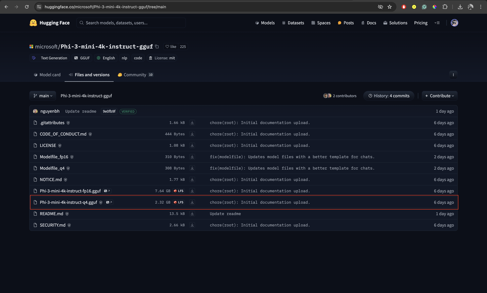
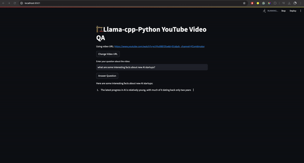
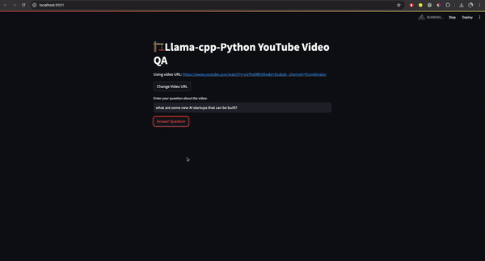

# llama-cpp-video-qa

A **Local VideoQA Engine** using `llama-cpp-python`, the mighty **Phi-3-Mini** model, and YouTube transcripts library.

## Setup

Please follow the following steps to run this locally on your machine.

### Clone the Repo

```sh
git clone https://github.com/vatsalsaglani/llama-cpp-video-qa.git
```

### Install dependencies

```sh
pip install -r requirements.txt --no-cache-dir
```

### Create a `model` folder

Create a model folder inside the `local-cpp-search` folder so that we can download the model in that folder.

```sh
mkdir model
```

### Download the model

[Download the quantized Phi-3-mini-4k-Instruct model in GGUF format from HuggingFace](https://huggingface.co/microsoft/Phi-3-mini-4k-instruct-gguf/tree/main).



> Remember to move the model to the `model` folder.

### Start the Streamlit app

```sh
streamlit run app.py
```

## Demo

Let's look at a real-time demo.

**_YouTube Video_**: https://www.youtube.com/watch?v=e1Yhs9BEOSw&t=51s&ab_channel=YCombinator

### Query: What are some interesting facts about new AI Startups?



### Query: What are some new AI startups that can be built?

